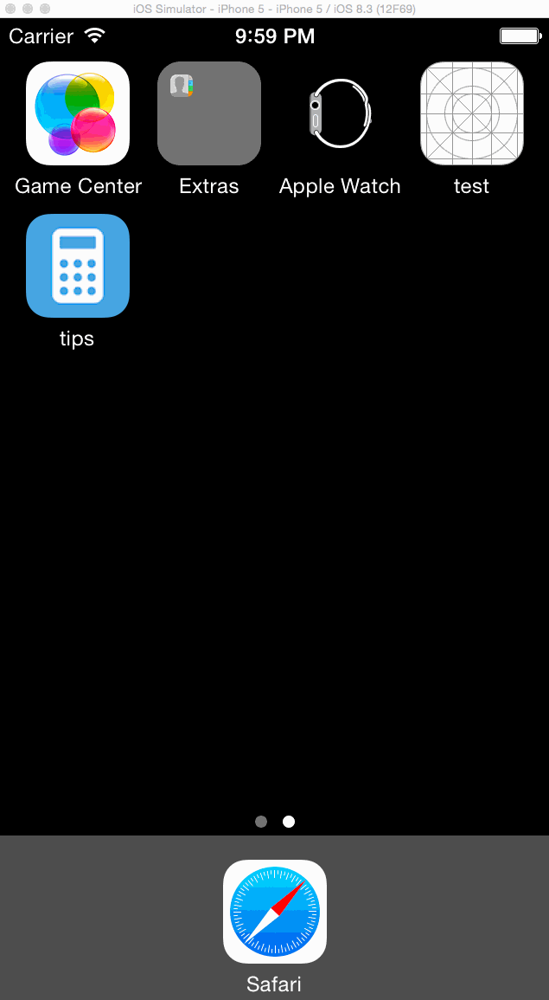

# TipCalculator

This is a Tip Calculator application for iOS submitted as the [pre-assignment](https://gist.github.com/timothy1ee/7747214) requirement for CodePath.

Time spent: 10

Completed:

* [x] Required: User can enter a bill amount, choose a tip percentage, and see the tip and total values.
* [x] Required: Settings page to change the default tip percentage.
* [x] Optional: UI animations. Fade out fields when bill amount is empty, fade in fields when bill amount has value
* [x] Optional: Remembering the bill amount across app restarts (if <10mins)
* [x] Optional: Making sure the keyboard is always visible and the bill amount is always the first responder. This way the user doesn't have to tap anywhere to use this app. Just launch the app and start typing.
* [x] Optional: User can set min and max values for tip slideBar

